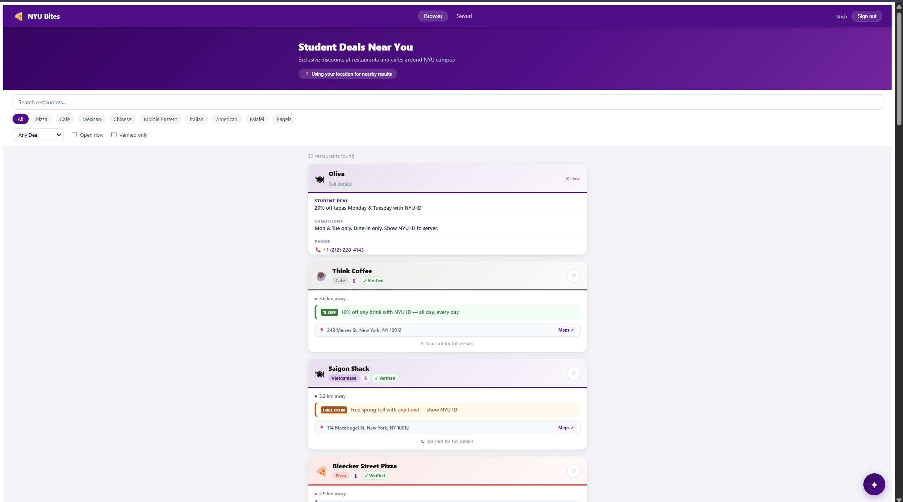

# NYU Bites 🍕

A full-stack web app that surfaces exclusive student discounts at restaurants and cafes around NYU campus. Browse deals, save favorites, and ask an AI assistant for personalized recommendations — all behind NYU email-only access.

**[Live Demo →](https://extraordinary-communication-production-b988.up.railway.app/)**



---

## Tech Stack

| Layer | Technology |
|---|---|
| Frontend | React 18, Vite, Nginx |
| Backend | FastAPI (Python, async) |
| Database | PostgreSQL + SQLAlchemy 2.0 |
| Cache / Auth | Redis — JWT refresh token rotation & revocation |
| AI | Groq API — llama-3.3-70b with tool calling |
| Deployment | Railway (4 services) |

---

## Features

- **Browse & filter** by cuisine, discount type, open-now status, and verified-only listings
- **Geolocation** — requests browser location once at app level and sorts results by distance using the Haversine formula
- **AI chat assistant** — ask natural-language questions like *"cheap pizza near campus open late"* answered with live database context via Groq
- **Flip cards** — tap any card to reveal full deal conditions, phone number, and a Google Maps link
- **Save restaurants** — heart any listing; saved list is persisted per account
- **Secure auth** — short-lived JWT access tokens, Redis-backed refresh token rotation, bcrypt-hashed passwords, and email verification flow

---

## Local Setup

### Prerequisites
- Docker Desktop

### Run

```bash
git clone https://github.com/srish1909/nyu-bites.git
cd nyu-bites
cp .env.example .env        # fill in your secrets
docker compose up --build
```

| | URL |
|---|---|
| App | http://localhost:3000 |
| API docs | http://localhost:8000/docs |

### Seed sample data

```bash
docker exec nyu-bites-api-1 python -m scripts.seed
```

---

## Project Structure

```
nyu-bites/
├── backend/
│   ├── app/
│   │   ├── api/v1/       # routers: auth, users, restaurants, agent
│   │   ├── models/       # SQLAlchemy ORM models
│   │   ├── schemas/      # Pydantic request/response schemas
│   │   ├── services/     # token creation, rotation, revocation
│   │   ├── agent/        # Groq AI agent + tool definitions
│   │   └── core/         # security, email, Redis, rate limiting
│   └── scripts/          # DB seed scripts
└── frontend/
    └── src/
        ├── api/          # Axios client + typed endpoint functions
        ├── components/   # Nav, FilterBar, RestaurantCard, AgentChat, Toast
        └── pages/        # Browse, Saved, Login
```

---

## Key API Endpoints

| Method | Endpoint | Description |
|---|---|---|
| POST | `/api/v1/auth/register` | Register with `@nyu.edu` email |
| POST | `/api/v1/auth/login` | Returns JWT + refresh token |
| POST | `/api/v1/auth/refresh` | Rotates refresh token |
| GET | `/api/v1/restaurants/` | List restaurants with filters |
| GET | `/api/v1/users/me/saved` | Saved restaurants for current user |
| POST | `/api/v1/agent/query` | AI assistant query |

---

## Deployment

Hosted on **Railway** with four separate services — backend (Uvicorn), frontend (Nginx), PostgreSQL, and Redis. Environment variables and secrets are managed per-service in the Railway dashboard.

---

## Author


**Srish** · NYU student  
[LinkedIn](https://linkedin.com/in/YOUR-LINKEDIN) · [GitHub](https://github.com/srish1909)
